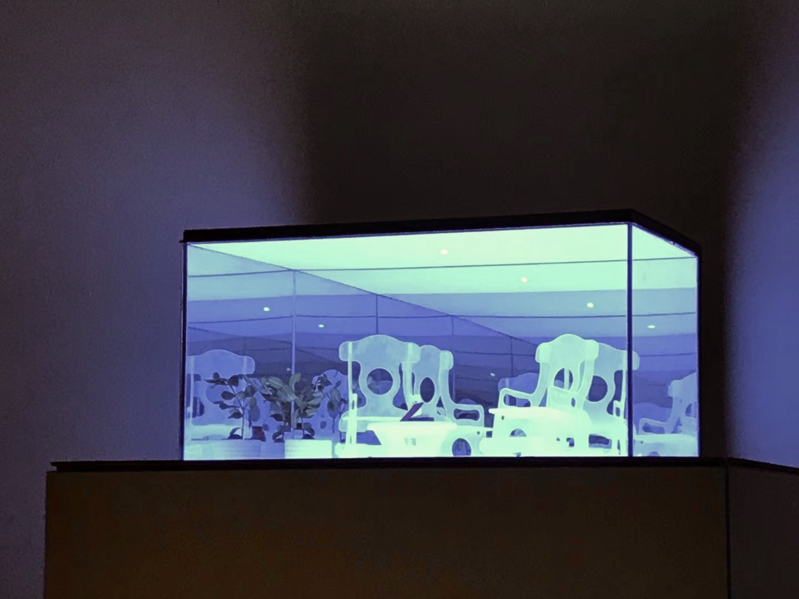

# Reflection

## Introduction
This is a course final project of [Intro to Physical Computation], by <b>*Fanyi Pan*</b> and <b>*Yongkun Li*</b>.

    

Reflection

Many people put on auto-pilot mode everyday. We forget to take a moment to stop and to cherish ordinary things in our lives. All different kinds of interactions have embedded meanings behind them.

The project aims at promoting a mindful thinking practice by letting users interact with everyday objects/furniture in a typical living room setting . Every interaction- from opening the door to sit on a chair could. trigger actions in the miniature model of the room which will be placed against a wall. The miniature model of the room is frame by a see through mirror cabinet to create an effect of infinity in order to show the room being a generic existence.

Interactions are as follows- User sitting on a chair will trigger the chair in miniature model to rock. Picking up the phone will results in flashing red lights on the floor, turning on the light of the actual room will trigger the light of the model to turn on, etc.

We use several technologies including position tracking in kinect, multi bluetooth devices communication and connection, sensor network, position mapping and projection using openframework.

## Design and Tech Behind It
- [Design Details]() 
- [Technology Details](./tech_spects.md)

## Credit
Thanks <b>*Sohaila Mosbeh*</b> for help of light design.

Thanks <b>*Helen Zegarra*</b> and <b>*Nicole Ginelli*</b> for help of high current issues in LED strip.

Thanks <b>*Jingyi Zhou*</b> for help of smoothing the LED animation. 
