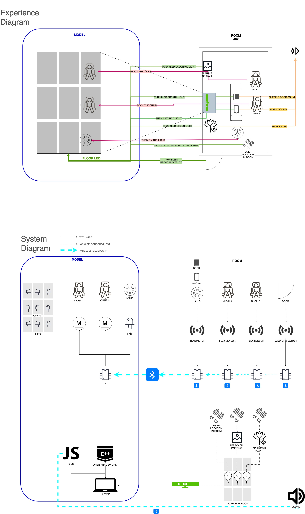
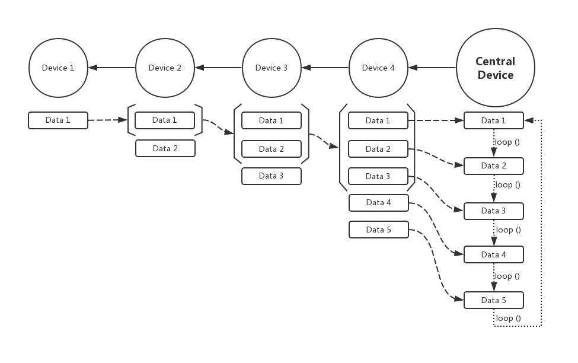
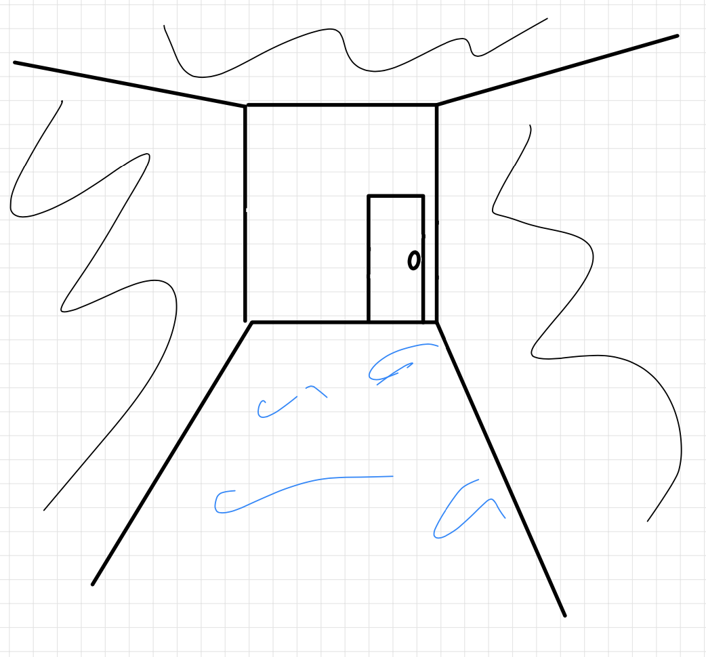
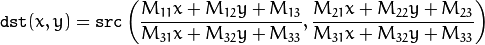
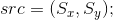
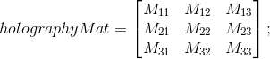
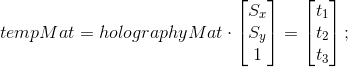
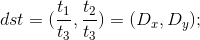

# System Diagram

> System Diagram

# Tech Details

## Bluetooth network

>Serial Network

### Network Structure
Our system utilize 5 Arduino NANO as separate bluetooth devices, one as the control center and the other 4 as sensor end connected to the central device. Due to the amount limitation of Arduino NANO's Bluetooth power, instead of connect all 4 peripheral devices to the central device at the same time (which is of "Star" topological structure), we use "Serial" shaped network structure. The structure is shown as the following.

As shown in the picture, we adopted a method similar to torch relay, which means that each device will send both its own data and all the former data to the next device in the serial. In this way, each device only need to connect two devices through Bluetooth - the former one and the next one. 

### Read & Write Data
In the earlier version, we send data continuously to ensure that the data can be updated in time. But this consumed plenty of power (one day for a 9V battery drops to 4v). Then we utilize the "Indication" feature of Bluetooth. The sequence device will only request data when it receives indication that the former device has updated the value. However as we have 5 devices in a Bluetooth network, somehow the last device can not get the data with this "update-request" mode, and the second last device can only write data when the last device has sent the request trying to read data. Which means that, the data flow can only work when the last device keeps requesting data.

### Optimization
As is mentioned before, to get the data from former device, request should be sent in advance, which greatly slows down the whole speed of the program. In the earlier version, other operations like updating LED matrix and reading from Serial communication is performed only after all the Bluetooth data has been obtained (in this specific case we need to request 5 pieces Bluetooth data). The framerate drops drasticly and the serial tube is blocked due to the delay. To solve this problem, instead of requesting all the data at once, we use Time Division Multiplexing (TDM) which means requesting one piece of data at each frame. In this case, all the devices can read and send data simultaneously.

## Kinect Position Tracking
The original idea is to show audience's position in real time by lighting up the LED accodingly. To achieve this goal, we need to track audience position. By just using one Kinect, we've tried out several methods to track the position as the following goes.

In our project we were using Kinect V1 1414. And the area of room we were using is 91*156.5 (inch^2).

### Top-Down Simple Blob Finding
Initially we tried out a simple method. We install the Kinect on the ceiling of the room. When tracking the position, we set a certain threshold to detect where people's heads are, then use `blobFinding()` to get the position. The accuracy was pretty good as the impact of the noise was relatively small and the furnitures can be easily ruled out since most of the time the height of people is greater.

#### View Angle Issue
However, the view angle of the Kinect is not large enough, which is $\pi/3$ in our case. Only one-third of the whole room could be detected. To solve this, we tried to set the Kinect on the edge instead of the center of the ceiling. Then the view from Kinect looks like the following picture.

 
> View From Edge

To get the proper position, we need to transfer the coordinates to the flooe dimension. To do this, the first step is to find the transforming matrix.

First we get 8 points, 4 on on the Kinect perspective, 4 on the simulated floor. When adjusting the mapping matrix, I use `cv::findHomography()` to get the transformation matrix `homographyMat`.

Then we need to calculate the mapped position using the transforming matrix. For image warping the function `warpPerspective()` is used, and in this function people use the following formula to get the transformed position:

 

After getting the position from the Kinect's perspective, I calculate the cross product of `homographyMat` and source point position matrix, then get the destination position. The calculation of `src(Sx, Sy)` to `dxt(Dx, Dy)`is shown as the following:

 

The transformation works pretty fast, but the distance threshold can only be set that the view area is in shape of spherical shell, which means that the furnitures can not be ruled out by simply setting the threshold.

### Horizontal View
With the forementioned limitations, we tried to find a way to track the position from horizontal view since Kinect can detect depth of objects in front of the camera. Once we get positions of people from camera's vertical view, we convert it to the position on floor plane.

To approach this, there are still some issues such as how to rule out furnitures, and how to filter the noise. We've tried following methods.

#### Frame Difference
The main idea to rule out the furnitures to get the position of people, is to track objects that are moving. To approach this, for every depth image obtained, we calculate absolute difference with the last one, then use `blobFinding()` to get the position of people. In real practice, this method can roughly caught where people are, but still affected a lot by noise in infrared image. The reason is that when people move to left or right, the depth of their main bodies keep same, which might lead to wrong blob finding.

#### Background Subtraction
Since the former method always sets last frame as the background, we tried to preset the background before every thing starts. After getting the background image, for every frame we get absolute difference of current frame with the background. Then we use [Opening](https://docs.opencv.org/4.1.1/d3/dbe/tutorial_opening_closing_hats.html) to filter out the noise. In this way, the result image only shows people's figure, making it much easier to find positions. 

But there are still some drawbacks. First since we use distance image to get the position, it's better to only let one person in the room as two or more people would result in overlapping in distance dimension. Second if a furniture is moved accidently, it will be regarded as a person before the background is retaken.

### Sum Up
In the end we use background subtraction with horizontal view to track the position, which works with high accuracy. Besides forementioned trials, another lesson is that it's better to utilize noised data with "gradient", such as some "approaching" effect, or changing with inertness. Initially we tried to present people's position by lighting up LED with the same coordinate on LED strip matrix, but the noise makes it keep blinking, which is not obvious for audience to notice the correlation.

## LED Effect
One of our initial design of the small room is to light up the LED according to the position of people in the real room. With the affect of forementioned factors (noised data), we've tried out several effects. In the following effects, `sin()` calculation plays an important role.

### Wave
Instead of lighting up the exact position LED, we tried to generate a "wave" effect on the floor. To realize this, every time the position changes, a black wave will be generated from center. We calculate distance of each pixel to the center, then each pixel will be addressed same color if is of the same distance to the center. The result looks good when only this effect is applied (without BLE and position tracking). In real practice, the noise makes it keep blinking, and the lap of BLE decreases the frame rate drasticly since some `sin()` and `square()` calculation also takes much time. Besides, the `<Adafruit_NeoPixel.h>` lib does not support addressing each pixel with individual brightness, which means that when we are applying other effect with color other than white, "wave" effect can not be applied simply.

### Breath
To let the small room looks more living, we add breathing effect. Normally we use linearly and periodically changed brightness to address all the pixel, then we tried `sin()` to calculate the brightness, which is visually more natural and periodic itself. However the calculation taking more time drops frame, so we went back to linear changing. Besides, when the room needs to change the color, we let the brightness dims down to the lowest brightness then apply the color changing to let it look more natural.

### Evening Sky
One of our interaction is that when the audience approaches a paint, the small floor will be applied the same color palette and keep flowing. So we use `sin()` calculation on Hue value of the color including time and flow-orientation dimension coordinate factors, then we set Hue value in a certain range. And `sin()` really helps with making color changing continuous.

## Other Issues
The code of our project mostly follows the principle of "state-machine", which means that the state of the small model is changed by different actions. During the process of development, most of the time is spent on how to let different state transformed smoothly and not effecting each other. On the other hand, the BLE part needs to be as realtime as possible and triggered when it's needed, so we applied "event-handler", which means that when an update is received, an according action will be taken while all other process will be blocked until it's finished. 
